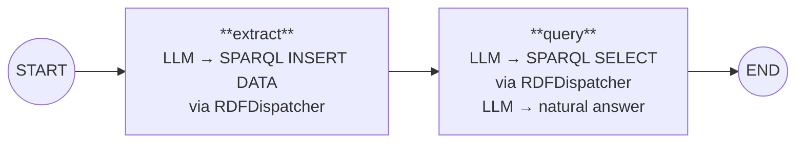

# rdf_reader Workflow

## Data Flow

| State key | START | After extract | After query |
|-----------|-------|---------------|-------------|
| `context` | Input text | — | — |
| `instruction` | User question | — | — |
| `triple_count` | — | N triples extracted | — |
| `sparql_result` | — | — | Raw SPARQL bindings |
| `messages` | — | "Extracted N triples" | Final answer |

## Single Tool, Two Operations

Both nodes use the same `RDFDispatcher.dispatch()` function — the single
CLI-like interface to Fuseki. The operation depends on the node's task:

- **extract**: `dispatch(INSERT DATA ..., "session", uuid)` + `dispatch(SELECT COUNT ..., "session", uuid)`
- **query**: `dispatch(SELECT ..., "session", uuid)`
